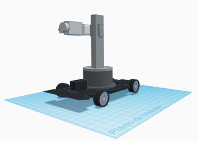
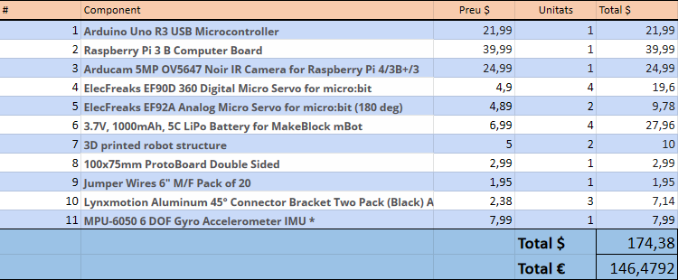
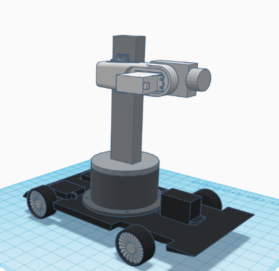
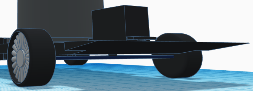

**Autors**
\
_Carlos Garay Aguinagalde - 1530356_
\
_Ferran Guasch Guasch - 1530047_
\
_David Durán Barberán - 1531664_
\
_Daniel Alonso Pérez - 1531551_ 

_**Projecte RLP**_ \
_**Universitat Autònoma de Barcelona**_

# Perceptronico
_"A vision substitution for blind people"_

## Table of contents
1. [Motivación](#motivació)
2. [¿Qué es?](#intro)
3. [Herramientas utilizadas](#herramientas)
4. [Componentes Electronicos](#componentes)
5. [Esquema Hardware](#hardware)
6. [Arquitectura Software](#software)
6. [Piezas 3D](#3d)
6. [Estrategia simulación](#3d)

## Motivación 
La OMS estima que hay 40 millones de personas ciegas en el mundo, mientras que las tecnologías existentes para facilitar la vida en un mundo no diseñado para esta condición aún mancan, o son poco accesibles. 
\
Atacando este proyecto des del punto de vista de la robótica, la idea es desarrollar un modelo 3D hardware, con todos los elementos software correspondientes, y listo para producción, diseñado para facilitar y resolver problemas que frecuentan a las personas que padecen de esta condición. 

## ¿Qué es? 
Es un robot con espacio de trabajo circular, capaz de mover la camera a la dirección del espacio donde la persona ciega tenga orientado el teléfono móvil para tomar una imagen, procesarla con un modelo de Visión por Computador ([YOLO v5](https://github.com/ultralytics/yolov5) y ) y devolverle un audio indicándole los objetos encontrados y su distancia relativa al robot.
También consta de un _Line Tracker_ que para un futuro proyecto podría mejorarse transformándose en un vehículo semi autónomo.
\
Todas las conexiones entre robot y móvil del usuario se realizan sobre **http** de manera que la distancia en la que se encuentre el robot y el usuario es indiferente.
\
El proyecto también consta de la aplicación móvil, encargada de la adquisición de datos del acelerómetro, que corresponden a los grados sobre los tres ejes del espacio el cual el móvil ha sido rotado,  de la transmisión de información. Esta también contiene otras funcionalidades como serian utilizar la camera del móvil directamente sin usar el robot. Para obtener la última versión de la aplicación dirigiese [_aquí_](https://github.com/fguasch/perceptronico_sm)

## Herramientas utilizadas 
* [Webots](https://github.com/cyberbotics/webots)
* [Jupyter Notebook](http://jupyterlab.io/)
* [Google Cloud Platform](https://cloud.google.com/)
* [Python](https://www.python.org/)
* [Thinkercad](https://www.tinkercad.com)
* [Fritzing](https://fritzing.org/)

## Componentes electronicos 

## Esquema Hardware 

## Arquitecutra Software 

---
Nota: Las conexiones en las que aparece  ‘(lectura)’ quiere decir que la conexión es inversa, es decir, el destino es el que lee los datos del origen, no es un envío de datos directo.

---

La conexión entre usuario-robot se implementa mediante: cliente socket (simulador del robot), servidor socket y API Google Drive.
\

Inicialmente, mientras están corriendo los sockets, tanto el cliente como el servidor, el usuario dispone de una aplicación capaz de enviar y recibir datos a través de la api de Google Drive. 
\

El usuario, a través de la aplicación, específica el movimiento deseado de los motores del robot para enfocar la cámara hacia un punto en concreto, la aplicación sube al drive un documento de texto plano con estos datos.
\

Paralelamente, el servidor comprueba cada cierto tiempo si una carpeta específica de Drive contiene el fichero con los datos enviados, en caso de no existir, el servidor envía al cliente un mensaje con el valor 0, en caso de existir, envía un mensaje con valor 1 y a posterior los datos leídos del documento.
\

El cliente socket (robot) recibe constantemente un mensaje con valor 0 hasta el punto de haber decidido un movimiento. En caso de recibir un 1, recibirá también los datos de rotación. El robot aplicará la rotación de los motores (forward kinematics), capturará la imagen de la cámara y finalmente la enviará al servidor.
\

El servidor, en el momento de recibir la imagen, la subirá al drive y será momento de aplicar el módulo de Visión por computador para el reconocimiento de objetos, que aplicará la misma lógica y subirá sus resultados a drive para que el usuario pueda acceder a ellos a partir de la aplicación.

## Piezas 3D  

* Base del soporte: Base cilíndrica con espacio en el interior para un servomotor de 360 grados con el objetivo de rotar el soporte vertical.
* Soporte vertical : Soporte rectangular rotatorio del brazo del robot
* Brazo de robot.
* Estabilizador: Soporte de la cámara con dos funciones: rotar o mantener la dirección hacia el frente. 
* Base con ruedas: Base similar a la de un vehículo, con 4 ruedas y espacios para 3 motores (dos para las ruedas traseras y uno para la dirección de las ruedas delanteras) 

## Estrategia de simulación  
En un primera instancia se decidio crear un mundo des de cero con [_openStreeMap_](https://www.openstreetmap.org) y usando el editor [_JOSM_](https://josm.openstreetmap.de/) pero despues de crear las [_SUMO networks_](https://sumo.dlr.de/docs/Networks/SUMO_Road_Networks.html), los ficheros necesarios para la creacion de trafico y habiendo correficado manualmente los errores en los ficheros .xml, vimos que seguian habiendo problemas en el numero de creacion de nodos y posiciones. Por consequente se decidio utilizar mundos, con pequeñas modificaciones, propiedad de Webots.
